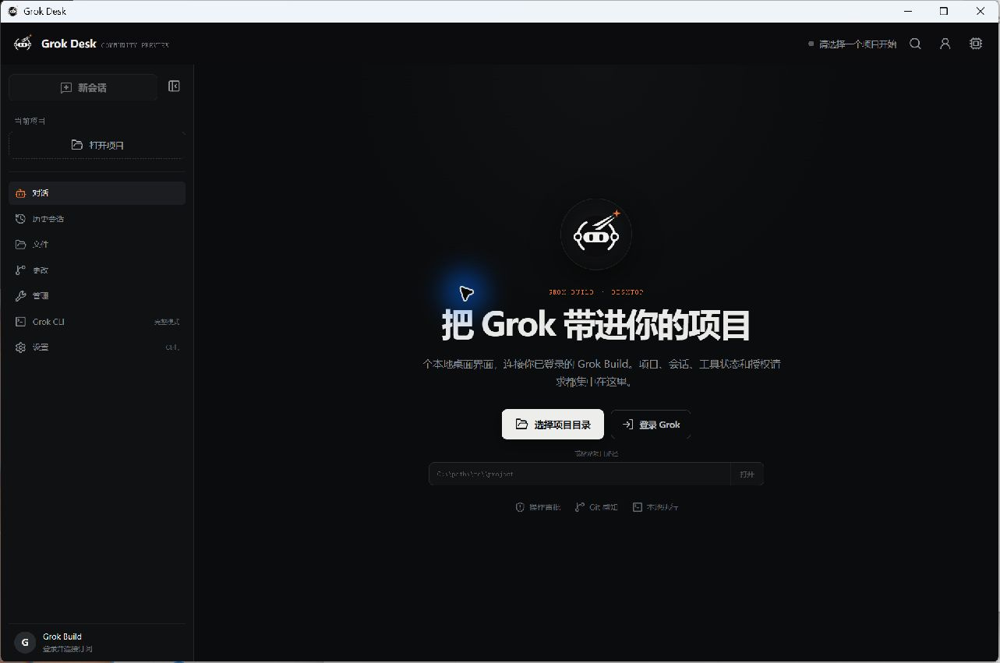

# GY Grok

[English](README.md) · [中文](README.zh-CN.md)

An unofficial desktop GUI for [Grok Build](https://x.ai) on Windows. It talks to the
official `grok agent stdio` over ACP v1, and keeps a full ConPTY terminal alongside so
any new CLI feature stays reachable.

> Community project. Not affiliated with or endorsed by xAI, X, or SpaceX. "Grok" and
> related marks belong to their owners. GY Grok does not provide, resell, or bypass any
> subscription.



---

## The part you probably haven't seen elsewhere

**Life mode.** Grok Build has no five hour limit. Nothing stops you, so you can work the
whole day and never notice until the week's credits are gone.

Everyone is watching AI safety. Nobody is watching human safety. So this client lets you
set a cap on *yourself*:

- Pick a daily share of your billing period, say 20%. Hit it and the entire window locks.
- Optionally set allowed hours. Nine to six, and it stays shut the rest of the time. Up
  to six windows, each with its own percentage.
- Choose when it opens again: next midnight, a clock time you pick, or rest N hours.
- **You can switch it off any time before it locks.** Once it locks, the rules freeze
  until the hour you chose. No early unlock from inside the app.
- Go around it anyway (back to the terminal, or edit what the browser stored) and it
  notices next launch, says *"You didn't keep your word"*, and takes away the highest
  reasoning tier until you promise not to do it again.

The lock screen reads:

> That's enough for today. Credits come back. This afternoon does not.
> Walk, eat something warm, put the screen down for a while.

There is a demo page at `app/生活模式演示.html` that shows every lock and dialog without
spending any credits.

**Computer control, built in.** Grok can see your screen and drive it: screenshot, move
the mouse, click, type, hotkeys, list and focus windows. It runs inside this app, binds
`127.0.0.1` only, and there is a switch in settings. No separate backend to start.

**Usage, made visible.** Plan tier, percentage left in the period, per-product breakdown,
next reset, prepaid balance, and per-thread token spend. All read from the official CLI.
This window only displays it; it never keeps a second ledger.

---

## Everything else

- Official login through the browser, OAuth, or device code. The GUI stores no password
  or token.
- Auth method, subscription tier, team/ZDR metadata, and Build session availability,
  detected after sign-in.
- Models, context limits, and which reasoning tiers each model supports, read live from
  ACP. Switch model or tier mid-session without restarting the task.
- Streaming replies, thinking segments, plans, tool calls, usage, permission approvals,
  error recovery.
- Grok session history: list, load, resume. Local project and display metadata persisted
  in SQLite.
- First-run trust prompt per project. File browse, search, and text preview, fenced to
  the directory you granted.
- Git branch, staged and unstaged status, bounded diff view for large files.
- Embedded ConPTY terminal that runs the full interactive `grok` TUI or any argument set.
- Read-only inspection of models, sessions, MCP, plugins, worktrees, leader, updates,
  disk, and config.
- Dark / light / system theme, command palette, keyboard shortcuts, and a privacy and
  security diagnostics export.
- Original app icon, portable EXE, NSIS installer, and MSI.

## Requirements

1. Windows 10 or 11, x64, with the WebView2 runtime (recent Windows ships it).
2. Network access to `https://x.ai/cli`. On first run the app installs the official Grok
   CLI itself if you don't have it.
3. A Grok or X account with Grok Build access.

Double-click `grok-desk.exe`. You do not need to install the CLI first, and you do not
need to start a backend. Login still goes through the official authorization page.

**First run downloads about 142 MB** (the official CLI) and leaves roughly 430 MB under
`%USERPROFILE%\.grok`. The GUI itself is 15 MB. The big number is the thing being
wrapped, not the wrapper.

## Using it

1. Launch GY Grok. It installs the official CLI if missing.
2. Click "Connect account" and complete the official authorization.
3. Pick a project and read the first-run trust notice.
4. Give Grok a task in the composer. Use the screenshot button, or let it take its own.
5. `Ctrl+K` opens the command palette. `Ctrl+1`…`5` switch views. `Ctrl+,` opens settings.

## Building from source

Needs Node.js 20+, Rust stable, Microsoft C++ Build Tools, and Tauri's Windows
dependencies.

```powershell
npm ci
npm run tauri dev
```

Full check:

```powershell
npm run lint
npm test
npm run build
Push-Location src-tauri
cargo fmt -- --check
cargo test
cargo clippy --all-targets -- -D warnings
Pop-Location
```

Portable EXE, MSI, and NSIS:

```powershell
npm run tauri build
```

### Shipping a build to someone else

```powershell
npm run pack             # clean zip into dist-release/, with SHA-256
npm run sandbox:release  # unzip it into a blank USERPROFILE and check it actually runs
```

Do **not** zip the `app/` folder by hand. Running from there creates
`grok-desk.exe.WebView2/` beside the executable, which is a browser profile holding
Login Data, Cookies, and History. `npm run pack` copies an allowlist and aborts if any
profile file sneaks in.

## Architecture and security boundary

```text
React / WebView (renders data only)
        ↕ Tauri commands and events
Rust host (validates paths, arguments, sizes, lifetimes)
        ├─ grok agent stdio (ACP)
        ├─ grok TUI (Windows ConPTY)
        ├─ read-only CLI / Git / workspace services
        ├─ built-in computer control (127.0.0.1 only)
        └─ local SQLite for display metadata
```

Grok Build remains the single source of truth for auth, subscription, sessions, models,
tools, permissions, and updates. GY Grok never runs backend management through shell
strings. Paths are canonicalized and confined to the workspace you granted. ACP and
terminal output have size and lifetime caps, and common secret-shaped fields are redacted
before tool and approval details are shown.

See [Architecture](docs/ARCHITECTURE.md), [Security](SECURITY.md), and
[Privacy](PRIVACY.md).

## Known limits

- Built and tested on Windows 10/11 x64 only. macOS is possible — the official CLI ships
  a `macos-aarch64` build, and everything except computer control ports cleanly — but it
  is not done. Apple Silicon only; xAI publishes no Intel macOS build.
- Installers are not signed with a commercial certificate, so Windows may show a
  SmartScreen prompt. Verify the SHA-256 from the release.
- Grok Build 1.0.x does not expose image or audio prompt attachments over ACP to this
  client, so those controls are hidden. The full CLI is always available as a fallback.
- Whether a permission request appears is Grok Build's decision; read-only operations may
  not prompt. Use version control and review the Changes view.
- Upstream experimental ACP fields may change. Unknown updates render as redacted
  structured cards.

## License

MIT. See [LICENSE](LICENSE).

Built by [GoyoungStudio](https://github.com/ggl003614-tech).
